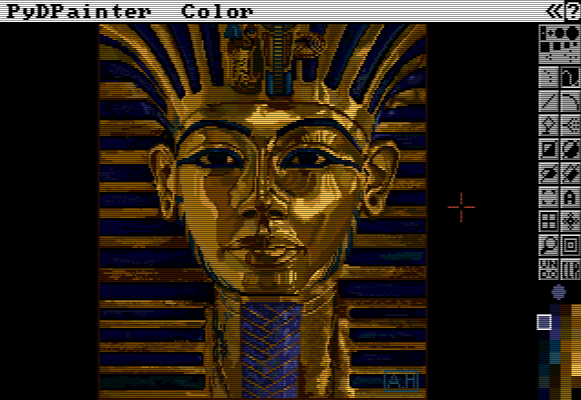

# [PyDPainter](https://pydpainter.org/)

A usable pixel art program written in Python

## About

PyDPainter, pronounced "Pied Painter" (like Pied Piper), is an attempt to create a usable pixel art program for modern computers in Python using PyGame.
The original inspiration came from the [Commodore Amiga](https://en.wikipedia.org/wiki/Amiga)
version of [*Deluxe Paint*](https://en.wikipedia.org/wiki/Deluxe_Paint) released by Electronic Arts in 1985.
Back then, *Deluxe Paint* helped define the user interface of a paint program with tool bars, menus, and the
novel use of left and right mouse buttons for painting and erasing. After pixel art gave way to photo-realism and
high-resolution 24 bit color, *Deluxe Paint* was largely forgotten for artistic work -- left behind
in the ever-progressing march of technology.

Recently, with a resurgence of all things "retro," low-resolution pixel art and limited color palettes
have become popular once again. Many tools to deal with this medium are either too complicated
or too crude. This project is an attempt to bring back an old but reliable tool and
enhance it with some features to help it better coexist in the modern world.

### [Download Latest Release](https://pydpainter.org/download.php)

YouTube videos:
* [Quick PyDPainter Demo](https://youtu.be/XwagsCdMj74)
* [PyDPainter 2.0 Trailer](https://youtu.be/l385Z7_CRB0)
* [PyDPainter 2.1.0 Trailer](https://youtu.be/xbe3t0TKU3g)
* [PyDPainter 2.2.0 Trailer](https://youtu.be/muISqT-eM_k)
* [PyDPainter tutorial playlist](https://www.youtube.com/playlist?list=PLhgHYZ9fWyHjocfn8Syo3kfIXT5irI-GC)

Ko-fi donation page:
https://ko-fi.com/mriale

Facebook group: [PyDPainter](https://www.facebook.com/groups/583338860398152/?ref=share)

Mastodon: [@PyDPainter@mastodon.social](https://mastodon.social/@PyDPainter)

See [RoadMap](https://github.com/mriale/PyDPainter/wiki/RoadMap) for current progress.

Documentation: [Table of Contents](docs/TOC.md)

## New Feature: Circular Colour Wheel

PyDPainter 2.3 introduces an intuitive HSV circular colour-wheel selector. 

* Open the palette dialog and press the **[Wheel]** button to display the wheel.
* Click anywhere on the wheel to choose a hue/saturation value; brightness is fixed at full, but you can refine with the existing HSV sliders.
* The chosen colour updates the current palette entry and stays in sync with the RGB / HSV sliders.

External Resources: [External Links](docs/links.md)

**PyDPainter Copyright (C) 2019-2025 Mark Riale** 
This program is licensed under the GPLv3 or later. See [LICENSE](LICENSE) file for more details.
