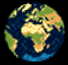
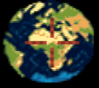

# Brush Menu

A brush is a rectangle of pixels grabbed from the screen, which can in turn be
used in all drawing tools, animation tools, or certain fill modes. To define a
brush, first click the `Brush` tool in the toolbar then drag a rectangle around
the desired area on screen. After releasing the mouse button, you will see the
brush follows the mouse cursor and you can draw with it on the screen. The
current `background color` (black by default) will be interpreted as a
transparent color.

- [Open...](#open)
- [Save as...](#save-as)
- [Restore](#restore)
- [Size](#size)
- [Flip](#flip)
- [Edge](#edge)
- [Rotate](#rotate)
- [Change Color](#change-color)
- [Bend](#bend)
- [Handle](#handle)

## Open...

Shows a file requestor to allow you to choose a file to
load as a brush.

_You can load these examples in `docs/menus/src directory`. Starting Earth
brush is `original.png`_

## Save as...

Shows a file requestor to allow you to save current brush to a file as a brush.
This is mostly used with iff/ilbm file types.

## Restore

Restore the brush as you defined it the first time you grabbed or loaded it. 

 key: `SHIFT-B`

- - -

## Size

### Stretch

Use the mouse to freely resize the brush. Proportions will be lost.   

 key: `SHIFT-Z`

### Halve

Reduces brush size by half, without any anti-aliasing. 

 key: `h`

### Double

Double brush size, without any anti-aliasing.
_This can help create a highly pixelated retro effect on text or graphics._ 

 key: `SHIFT H`

### Double Horiz

Horizontally double the size of the brush. 

 key: `SHIFT-X`

### Double Vert

Vertically double the size of the brush. 

 key: `SHIFT-Y`

- - -

## Flip

### Horiz

Flips brush direction horizontally, right and left are reversed. 

 key: `x`

### Vert
Reverse brush direction vertically, top and bottom are flipped. 

 key: `y` 

- - -

## Edge

### Outline

Adds an outline of the foreground color. This operation can be repeated for a
larger contour, including by changing the color. 

 key: `o`

### Trim

Removes a one-pixel edge around the brush. If the brush has holes (background
color is transparency) or irregularities inside, this will also alter them. If
this operation is repeated, the brush will eventually be completely trimmed. 

  key: `O` 

- - -

## Rotate

### 90 Degrees

Turn the brush 90 degrees. If repeated, the brush will be rotated 180 then 270
degrees, and finally back to its original position.

_Please note that this is not the same as `FLIP X or Y`. Very useful for adding
some variety using the same brush._  

   key: `z` 

### Any Angle

Use your mouse to rotate the brush freely. 

 _Use 23.4&deg; for Earth_ :smile:

### Shear

Slant the brush horizontally with the mouse. _Think italics!_

  
- - -

## Change Color

### BG -> FG

Changes one color to another in the brush. This makes everything that is the
current `Background (BG) color` into the current `Foreground color (FG)`.
Carefully select each color in the toolbar before using this function. 

 _(orange has been changed to yellow)_

### BG <-> FG

Exchanges two colors in the brush. This is the current `Background (BG) color`
and the current `Foreground color (FG)`. Carefully select each color in the
toolbar before using this function. 

### Remap

Try to `remap`, _to approximate as closely as possible,_ the original brush
colors in the context of the new palette colors. This only makes sense if:

* loaded a brush with a color palette that doesn't match the current image
* you've edited the color palette
* you've loaded a new image that has changed colors

### Change Transp

Changes the brush `transparency` from the current background color.
Note: if you want a brush with no transparency, just use `Repl MODE` (F3). 

_Only one color can be transparent. If you had transparent black and wanted
orange to be transparent too, you couldn't. In this case, fill the orange with
black before redefining your brush._

- - -

## Bend

### Horiz

Deforms brush horizontally along a curve. 

 

### Vert

Deforms brush vertically along a curve. 

 

- - -

## Handle

Defines the handle point (shown as a crosshair). This point is used for all
on-screen drawing and animation tools. It cannot "leave" the screen.

### Center

Defines the handle point in the center of the brush. It's by default. 

 key: `Alt-s`

### Corner

Sets the cross at a `corner` of the brush, starting with the top left corner.
If you repeat, the corner changes around the imaginary square that surrounds
the brush. 

 
  key: `Alt-x`

_Drawing with a brush held by a corner allows you to draw close to the edges of
the screen and change the behavior of drawing tools._ 

### Place

Use the mouse to freely define the brush's handle point.  

 key: `Alt-z`

###### Documentation written by Stephane Anquetil
