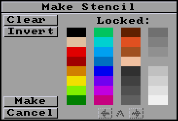

# Effect Menu

- [Stencil](#stencil)
- [Background](#background)
- [Perspective](#perspective)

## Stencil

The Stencil effect allows you to lock certain colors so that they cannot
be painted over.
This is a simple way of specifying a foreground layer where
any drawing on the screen goes behind this foreground layer.
When a stencil is active, an inverse `S` appears on the title bar.

### Make...

The `Make` menu item brings up `Make Stencil` requestor that allows you select which colors to lock.

- Click on any of the colors in the requestor to toggle an indicator whether the color is locked or not.
- You can also click or drag the mouse on colors in the picture:
  - If you drag with the left mouse button, the colors are added to the stencil.
  - If you drag with the right mouse button, the colors are removed from the stencil.
- The `Clear` button removes all colors from the stencil.
- The `Invert` button toggles all the selected colors to be deselected and the deslected colors to be selected.
- The `Make` button creates the stencil.
- `Cancel` leaves with no changes.

### Remake

The `Remake` menu item recreates the stencil from the current image. If you painted with some of the locked colors after you created a stencil, `Remake` will add these pixels to the stencil.

### Lock FG

`Lock FG` (lock foreground) creates a stencil out of everything that is not color zero. If you have a background enabled, this will be everything drawn on top of the background.

### Reverse

This reverses the current stencil so that every pixel that was locked will be unlocked and every pixel that was unlocked will be locked.

### On/Off

This temporarily disables the stencil so you can draw anywhere. It can be toggled back on by selecting the menu option again.

### Free

This deletes the stencil. You can now draw on the image normally.

## Background

A background is a layer behind an image. Anything you paint or draw
over the background layer will hide parts of the background, but when you erase
the drawing with the right mouse button, the background will reappear under
the drawing.

There are two background modes that are indicated in the title bar:
- `B` - Background (`Fix` menu item)
- `R` - Reference (`Open...` menu item)

### Fix

- Creates the background from the current image.
- Shows a `B` indicator in the title bar.
- If you save the image with the background showing, the image and the background will be flattened into a single picture.

### Open...

- Opens a file requestor to allow you to load a reference image, which can be any resolution or color depth and does not effect the image you are editing.
- Shows an `R` indicator in the title bar.
- If you save the image with the reference image showing, only the image will be saved. Color zero will be saved where the reference image was.

### On/Off

- Toggles the background image so you only see what you've drawn over top the background.

### Free

- If the `B` indicator is on, the `Free` menu option merges the foreground and background back into one image again.
- If the `R` indicator is on, the `Free` menu option clears the background picture so you only have what you've drawn over top the background.

## Perspective

_Not implemented yet_

###### Documentation written by Stephane Anquetil
