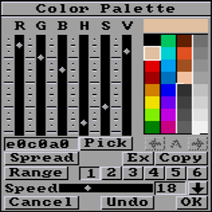
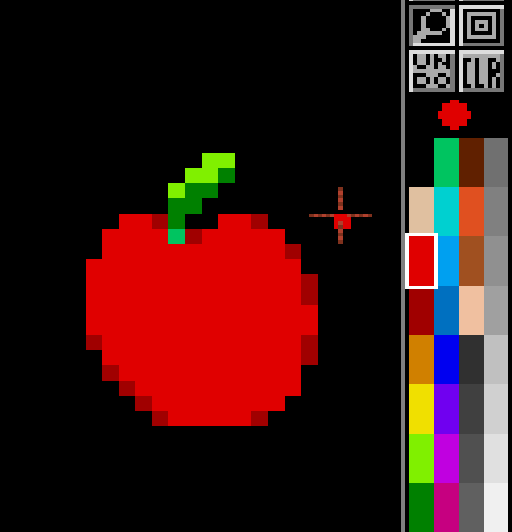
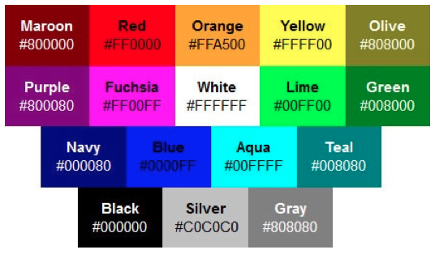
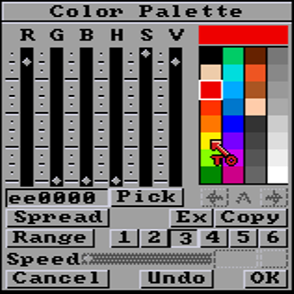

# Color Palette

_Work in progress..._

- [RGB values](#rgb)
- [HSV values](#hsv)

## Global principles

Imagine you've got a set of colored pencils. Instead of being able to choose any shade of color, you're limited to a certain number of predefined colors. This number and choice of colors depend on your 8/16-bit computer and the screen formats it can display. For example, an Amiga 500 could display 32 of 4096 colors in low-resolution. Today, these limits are simulated, as the screen resolutions available are all in 16 million colors. **PyDPainter** emulates old PC and Amiga screen resolutions in the `picture / screen format` menu.

At the time, rather than representing each pixel of an image using a combination of **RGB** (Red, Green, Blue) colors, as we'll see, we used an array, a sort of list of colors called a palette. This palette contains a limited number of colors: 256, 32, 16, and sometimes fewer.

Each pixel in the image is then associated with an index number from this palette, rather than with an RGB combination.

For example, if you wanted to draw a red apple in a program like **PydPainter / DeluxePaint** using indexed colors, you might choose number 2 in the palette, which has been predefined to be a nice shade of red.

  
*(as is often the case in computing, it starts with black at 0)*  
The advantage of this approach was that it saved storage space, as you didn't need to store three RGB values for each pixel. 
For you, as a modern pixel artist, it's the assurance of sticking to the limits of the times, and even of publishing your creations on these systems (by emulation or on real hardware).

> I would recommand to visit https://amiga.lychesis.net/index.crt.html for inspiration. Take a close look at how thoses images have been created with few colors. Move the mouse over an image to see the palette used.

In short, `Color Palette` is where you choose your colored pencils, their order and whether or not to use them in gradient ranges for the more advanced functions.

## RGB values

Imagine you want to create every possible color using just three special lights: one red, one green and one blue. That's exactly what the RGB system does.

RGB stands for "Red, Green, Blue". It's as if you had three magical friends who could create any color by mixing these three lights in different ways.If all the friends turn their lights on full blast, you get white. And if they all turn off their lights, you get black. The trick comes when they turn on their lights at the same time, at different intensities. For example, if red is strong, green is medium and blue is weak, you get a color like yellow. It's a bit like mixing paints, but with lights.
  
*3D rendition of 3 color spots. In reality, blue is less bright.*

PydPainter's sliders represent the intensity of these three lights, from 0 at the bottom, to 16 at the top (4096 colors) or up to 256 in AGA (16M colors).

## HSV values
The H S V system is more intuitive for painters used to the color wheel.  
  
*H is the rainbow, S fades to white, then V darken to black.*  

`H` is the hue, i.e. the brightest color around the color wheel. It's start at the bottom from red to orange, yellow, green, blue, violet, and up to red again, including all the colors of the rainbow. `S` is saturation, the transition from pure color to white, via more subtle, desaturated colors. Finally, `V` is value, which darkens the color more and more until it reaches black. *Of course, nowadays software can display a nice color wheel, but in that era, the number of color at screen was limited.*

## Hex (web) values

Hexadecimal values are used in color coding for the web (html, CSS, etc.). It's like the R G B system, but instead of using numbers from 0 to 256, we use digits from 0 to 9 and then letters from A to F. A equals 10 and F is equivalent to 16.

Each pair of numbers or letters represents a color component.

For example, the hexadecimal code "#FF0000" represents the color red. "FF" means that the red component is at its maximum, and the other two components (green and blue) are at zero.

This field accepts direct typing of these values.

*If you want to see anytime the hexadecimal value of a color, simply stop the mouse on the color, and the #hex and RGB values will be displayed at the bottom of the yellow tooltip.*

## Pick
Activates the color picker to fetch a color value from the screen. Click the `Pick` button, cursor change, then click the left mouse button to pick up the color under the pipette.  

*Tip: Only works in the PydPainter canvas (not on the UX). If you need to reproduce the colors of a reference photo, you can load it as a reference in the `Effect/Background/Open` menu, Color Pick will work.*

## Palette index navigation <-A-> 
For screen formats greater than 32 colors, the arrows allow you to navigate through the other colors. To help you find your way around, the index displays a letter from A to H (8 pages for up to 256 colors).

*Please note that you can use these arrows to fetch a color location in the middle of a gradient creation, swap or color copy operation.*
## Spread
This function lets you create color gradients. These gradients use more or less color slots, which must follow each other in the palette (vertically). Select a first color at one end of the color slots. Click on the Spread button, the mouse pointer changes to a red "to" arrow, and then click on another color slot.  

  

The gradient is created, very "mathematically", by a uniform color transition.

*Tip: I advise you to manually edit the gradient colors or introduce a few disturbances for a more natural look. For example, a metallic gradient of greys will be more interesting if the lighter greys tend towards pink and the darker greys towards blue.*
## Ex
Swap two color slots. Click on the first color, click on the `Ex` button, the mouse pointer changes to a red "to" arrow, then the second color. The exchange takes place instantly.
*Tip : This is very useful for reorganizing a palette resulting from a picture import/conversion. Colors are good, but slots are messy, making it impossible to use powerful PyDPainter [Modes](menus/src/mode.md) and gradients.*
## Copy
Copies a color to another location (**overwriting it**). Click on the color to be copied, click on the `Copy` button, click on the destination slot.
*Tip: You don't want to keep two copies of the same color and waste a slot.*
## Range
A `range` is a sequence of colors that allows you to use advanced drawing modes such as Smear, Cycle, etc. and gradients fills. 

To define a range. *First order your colors by adjusting the sliders and using the Ex, Copy and Spread tools.* Select a range slot between `1` and `6` *(see below)*.  Click on the first color, then click on `Range`, and finally choose the last color you want in your selection. A kind of white bracket surrounds the colors of the range. Each time, the previous Range is replaced by this one. If you've made a mistake, just start again.

## 1,2,…6 range selector

You have 6 ranges at your disposal. Click on the button to display the corresponding range. A kind of white bracket surrounds the colors of the range. The button remains pressed to remind you which one you're on. There are already two ranges defined by default. Click on `1` to see the one in grayscale. Click on `2` to see the other one in red to green colors.
  

*Pre-defined ranges.*

 Initially, slots `3` to `6` are free. When you exit the palette, it is the selected foreground color that is used to determine which range you are working with. Beware, some colors can belong to two different ranges, which can be confusing.
*If you've chosen a screen format with fewer than 32 colors, you won't see as many.*
## Speed
### Cycle speed preview
## Up/Down range

