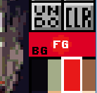
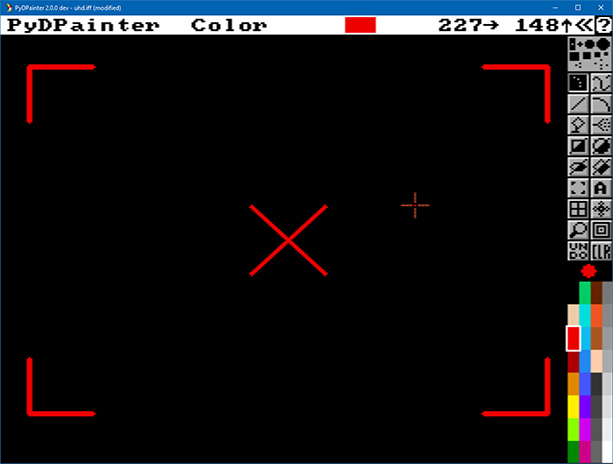
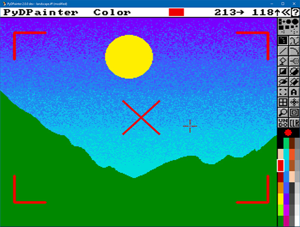
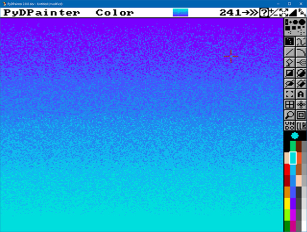
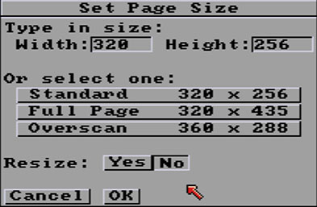

# Picture Menu

## New...

Shows the [Screen Format requestor...](screenformat.md) to allow you to choose a new canvas to paint on.

Key: `CTRL-n`

*Tip: remember that the defining characteristics of pixel art are low screen resolution with large pixels visible on the screen. Similarly, the number of colors used is limited, as is the number of tints available.* 

## Open...
Loads bitmap images in the following formats:
*  .iff or .ilbm (Amiga legacy), from 2 colors to 16 million colors (conversion to 256 colors max)
* .lbm IFF PBM (PC), 256 color format used on the PC versions of Deluxe Paint
* .bmp Windows BitMaP image (up to 256 colors)
* .gif GIF (still image. Animated GIFs are supported, but in the animation menu)
* .jpg .jpeg JPEG, a lossy photo compression format (conversion to 256 colors)
* .png (conversion to 256 colors if necessary)
* .tga Targa images

Key: `CTRL-o`

> Please note! The size of modern images may exceed **PyDPainter** built-in screen sizes, in which case they will be larger and continue beyond the screen displayed, below the interface. You can scroll them using cursors keys. [see Page Size](#page-size).

The file query is inspired by **DeluxePaint** legacy. You can move up one level in the tree structure by clicking on `.. (parent dir)`
Above all, you can change the drive by directly typing its letter in the path:  
`D:\`  
`C:\Users\Utilisateur\Pictures\`

If you're not used to DOS paths, Windows Explorer can show you the DOS path. Take any file explorer window. Just click on the little (yellow?) icon just before the normal path. i.e.:  
icon `> This PC > DATA (D:) > Test > PyDPainter > iff_pics` which then changes to  
`D:\TestT\PyDPainter\iff_pics`.

> You can download sample images from the [Amiga picture archive here](https://amiga.lychesis.net/index.html).
> In some cases, click on the little disk icon with the IFF arrow to download an image that you can view "in its original state" here and see how the colors have been used, cycled, etc.

### Conversions
**PyDPainter** is not designed as a high-performance conversion tool. If you need to convert an image to low-resolution, indexed color formats, you can use the following tools:  
- [Online conversion tool](http://tool.anides.de/)
- [GIMP](https://www.gimp.org/) image editing program
- A display/converter such as [XNView](https://www.xnview.com/en/xnview/)
- You can also use any old **Adobe PhotoShop**. It still saves images in the Amiga's iff format.

## Save
Saves the image in the same format as you loaded it, overwriting without prompting.

Key: `CTRL-s`
## Save as...
Saves the image by requesting the desired format. You can choose from the same formats as with open. Use the small drop-down menu to the right of the file name.

Key: `SHIFT-CTRL-s`
## Revert
Reloads the image as you last loaded or saved. Be careful, it will remove everything you've done since then. Handy if you want to try things out from within an image.

Key: `CTRL-ALT-z`
## Print...
_not supported_
## Flip
Immediately performs an inversion on the entire image.

Assuming your starting picture looks like this: 
  

### Horiz
horizontally (right-left reversal) 
  

### Vert
vertically (up-down flipping) 
  

## Change Color
With a palette often limited to only 32 or 16 colors, you'll need precise color management. That's what these tools are for.
### [Palette...](palette.md)
Key:`p`

### Use Brush Palette
Abruptly replaces the palette with that of the last `Brush` you loaded.
*If you're not into psychedelic effects, you'll probably want to use the [Remap](#remap) function after this.*

### Restore Palette
Go back to the palette that the picture had when it was loaded from disk

### Default Palette
Replaces current palette with default palette (which is **PyDPainter**'s palette, inspired by **DeluxePaint**'s palette)

*If you're not into psychedelic effects, you'll probably want to use the [Remap](#remap) function after this.*

### Cycle

Activates color cycling as defined in the palette (see [Range](palette.md#range) and [Speed](palette.md#speed)). This produces animation effects solely by sliding and replacing colors.  

Key:`TAB`
### BG -> FG
Changes all pixels in the image that are of the color defined by `Background Color` into the `Foreground Color`. 
 
*For example, you have an imported image that uses almost the same red twice. If you change one of the reds in the palette to orange, this affects the pixels in that red. By first using this function to pass the red pixels into the other red, you free up a color slot for your orange.
First select your first red in BG, then the other red in FG (remember that a simple left-click on this part activates an eyedropper to pick up the color).*  

### BG <-> FG
Swaps foreground and background colors throughout the image.

*Tip: If you want to swap two colors in the palette, use the [EX button](palette.md#ex-echange) in the Palette.*

### Remap

After rearranging the colors in the palette, you'd like to give your image, which now looks completely psychedelic, a once-over. Use `Remap`, **PydPainter** will do its best to re-display the image with your new palette.See also `Remap` in the [Brush Menu](brush.md#remap). `Undo` does not reverse this change.

*Note that if you've really upset the color tones, it's going to have trouble. If you've just rearranged the colors order to get new ranges, this is the function for that.*

## Spare
You always have a draft page to work with. This `Spare` screen is there for scribbling, storing brushes, test filling, test tiling, etc., without destroying your current project. It can also be merged with your main project.

*As long as you haven't saved a project or created an animation, the two are equivalent. The spare screen cannot be different in terms of screen format.*

### Swap
Toggles between the spare screen and the current project. When you first call it up, the spare page is the standard screen size, all black, with exactly the same color palette. If you wish to use a larger page size on the spare
page, you will need to make the appropriate selection from the [Page Size](#page-size) option.

Key: `j`

### Copy To Spare
Copies the picture on the current page to the `Spare` page. This lets you
experiment with your picture on the spare page without fear of losing
anything.

Note: If you are working on frame 24 of an animation and you activate this function, you will only copy frame 24 to the draft, while keeping the animation intact. You do your tests. And if you're satisfied, you can call up this function again from the `Spare` to copy to frame 24.

Key: `Shift-j`

### Merge in front
Merges the spare page in front of the current page. When the spare page
is brought forward, all pixels matching its current background color will
appear transparent, allowing images on the current page to show
through.

Example:

Current page  
  
Spare page  
  

**Merge in Front** result  

### Merge in back
Merges the spare page in back of the current page. When the spare page
is put behind the current one, all pixels which match the current page's
background color will appear transparent, allowing images on the spare
page to show through.

Example :
Spare page  
    
Current page  
  

**Merge in back** merging result:  

## Page Size...
Displays a context-sensitive request (depending on the current screen format: **PC**, Amiga **NTSC** or **PAL**) to enlarge the work area beyond the conventional size.

The **Standard** format is the screen format of the time. It had a border surrounding it.  
*If you're looking to respect the legacy format of the time (for a gfx competition or retro dev), this is the one for you.*

However, it was already possible to work in **Overscan** without this border, which covered the entire monitor. This was the case for video overlay, professional animation, some games and demoscene.

**Full page** refers to the surface area required for a printed sheet of paper.

You can freely enter the pixel size of the screen you want in the `Width` and `Height` fields under **Type in size**.  You are no longer limited by your memory but by an arbitrary limit of 9999 pixels. Note, however, that you will be unable to view the entire image on the screen with larger page sizes. You'll have to use the **arrow keys** on your keyboard to move around your image. 

*A large page size allows you to paint very wide landscapes or provide huge sprite boards for a game.*

## Show Page
Displays your current page in its entirety in a reduced format -
for example, in 640 x 400 page size in Lo-Res, it shows only every other pixel.
Pressing `OK` button returns you to the current page.

Key: `Shift-S`

## [Screen Format...](screenformat.md)
Changes the display format emulated by **PyDPainter**. This is the same request as `New` but - trying - to keep the current drawing.

## About...
Displays the program's About requester showing the program version
number, the author's name, the copyright notice and license.

*Note that versions with the suffix* dev *are development versions. You can test the latest functions and hunt for bugs.*

## Quit
Exits PydDPainter.

Key: `Shift-Q`

###### Documentation written by Stephane Anquetil
