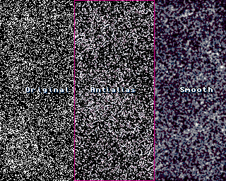
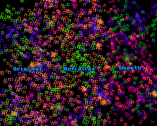
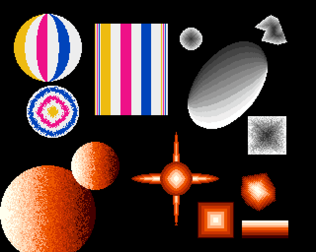

# Fill Type

- [Solid](#solid)
- [Brush](#brush)
- [Wrap](#wrap)
- [Pattern](#pattern)
- [Antialias](#antialias--smooth)
- [Smooth](#antialias--smooth)
- [Gradient](#gradient)
- [Dithering](#dither)

Right-clicking the **Fill tool**  or the lower-right half of most drawing tools displays this **Fill Type** requester: 

The options in the requester are explained in the following paragraphs.
When you return to the painting screen after choosing a fill
type, the current gradient (or pattern, if **Pattern** is selected) and its orientation are shown in the Color Fill box in the menu bar:

|  |
| :----: |
| *Bar fill status examples.* |

## Solid

**Solid** fills with the current color with no added effects. If you paint or fill your shape using the left button, the shape is filled with the foreground color. If you paint or fill your shape using the right mouse button, it is filled with the background color.

## Brush

**Brush** fills with the current custom brush and sizes it to fit the filled area.

|  |
| :----: |
| *The current defined brush is on the left. Examples of fills in a variety of shapes, from rectangles on the left, to polygons on the right, to circles and inclined ellipses.* |

## Wrap
**Wrap** fills with the current custom brush and adjusts it to the horizontal and vertical shape of the filled area. This gives the illusion of wrapping the brush around a 3D solid. The effect is most pronounced if you use it to fill a shape that is very different from the shape of the custom brush.

*See the comparative examples below.*

## Pattern
**Pattern** fills with a pattern made from current custom brush. It's a "wallpaper" type of filling. There's no stretching, no distortion. It's the patterned fill of early monochrome drawing software.

|  |
| :----: |
| ***Brush*** *respects the original image of the brush.* ***Warp*** *gives interesting effects on rounded shapes. There are no predefined rules: it's up to you to experiment!* |

## AntiAlias & Smooth

The following two modes are new to **PydPainter**:
* **Smooth** allows you to use the drawing mode of the same name (that of the F8 key) with fill tools. It's a brutal softening, which can give interesting  effects (blur, textures).
* **AntiAliasing** is a more modern mode, which really smoothes the sharp borders of pixels. It's perfect for lettering, diagonal lines or softening the contrast.

*Note that you need an existing design to have a visible effect.*

|   |
| :----: |
| *Some AntiAliasing and Smooth examples. **Original** here, can be quickly redone with the Airbrush, or 5-point random brush in various colors.* |

Note that with a limited palette of 16 or less, the performance of these two modes will depend on the color values available in the palette.
If you're smoothing red on a black background, but no dark red/brown color is available, PyDPainter will do its best by using purple and dark grays. Under no circumstances will it alter the palette for you. 

## Gradient

**Gradient** Fills offer a host of creative uses. Their rendering will depend as much on the colors range chosen in the palette, the shapes drawn, as on the options selected here.

|  |
| :----: |
| *Examples with a suite of 6 colors (3 bright yellow, cyan, blue and 3 white), a 7-color orange gradient and the default grayscale (12 colors).* |

**Remember to select one of the [Range](palette.md#range) colors as foreground color to select your gradient and get this type of preview.**

 Select one of the five options by clicking it with the left mouse button. Preview will update automatically.

**Vertical fill** paints the gradient vertically from left to right with an even distribution.

 
**Vertical Line** fill paints the gradient vertically from top to bottom, one line at a time and adjusts the gradient on each line so that it follows the contours of the shape being filled.

**Horizontal fill** paints the gradient horizontally from top to bottom.

**Horizontal Line** fill paints the gradient left to right one line at a time and adjusts the gradient on each line so that it follows the contours of the shape being filled.

**Vertical and Horizontal** both lines ??? help !!!

*The preview uses the shape of a circle, but remember that the fill tools can fill the whole screen, and any type of shape.*

## Dither

Dithering is the blending of pixels within a **Range** defined in Palette. Usually, it's a gradient, but it doesn't have to be. It can be ordered dithering or a random dithering setting from none to increasingly blended.

### Ordered dithering

To use this quasi-geometric rasterization, pull the **Dither** slider all the way to the left. Notice that number to the right of the dithering slider turns into an ordered dithering icon.

### No dithering

If you don't want to use dithering, set the **Dither** slider to **0**.

### 1 to 20 dithering

The further the **Dither** slider is pulled to the right, the stronger the blend. Values range from 1 (very light) to 20 (a mishmash of colors).

Dither 2. The beginning of natural randomness.

Dither at 8. More of a mixture, it can be used as a base for coloring rocks or plants.

Max dithering (20). The gradient is barely recognizable. Can be used as a base before using other drawing modes such as Smooth or Blend.

###### Documentation written by Stephane Anquetil
