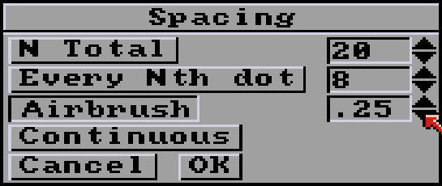
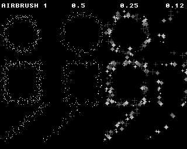

# Spacing options

- [Spacing options](#spacing-options)
    - [New in the version 2.0.1](#new-in-the-version-201)
  - [N Total](#n-total)
  - [Every Nth dot](#every-nth-dot)
  - [Airbrush](#airbrush)
    - [New decimal values in the version 2.0.1](#new-decimal-values-in-the-version-201)
  - [Continuous](#continuous)
          - [Documentation written by Stephane Anquetil](#documentation-written-by-stephane-anquetil)

|  |
| :-----: |
|*Spacing options. These options make more sense with a custom brush, otherwise it just looks like dotted lines. **Continuous** is default drawing mode.* |

### New in the version 2.0.1 
Numbers spinners : click to increment or decrement values. Keep pressing to go faster.

## N Total

Defines the total number of times the current brush will be copied along the path. For example, if you draw a circle with a **total spacing** of 14 with a star-shaped brush, this will make a round of 14 stars.

|  |
| :-----: |
| *Combined with the [Cycle](../../menus/src/mode.md#cycle) mode using a color range, gives this kind of effect.* |

*Note: With shapes that have multiple line segments like rectangles and polygons, the N Total property is applied to each line segment.*

## Every Nth dot

Defines the regular pixel spacing between each time the current brush will be copied along the path. This spacing remains the same whatever the length of the line, the size of the rectangle and so on.

*Note: The default spacing of 8 pixels can be covered by brushes larger than 8 pixels.*

## Airbrush
**Airbrush Spacing** setting also has an impact on the **Draw** tool, even though the right button on this tool limits it to the half part, opening the Fill Type.
Airbrush paints using the airbrush tool along the path defined by any tool affected by the **Spacing** requester. The number '16' by default sets the number of airbrush sprays to be applied at each pixel along the path. We recommend lowering it to 1 to 8 to better understand the effect. This creates a fuzzy line or shape. You can use this feature with the painting modes from the [Mode](../../menus/src/mode.md) menu to create interesting
effects. For example, using Smooth, Smear, Tint or Cycle with the Airbrush spacing can create interesting textured effects.

### New decimal values in the version 2.0.1 
Values from 1 to 0 are now accepted. The first aim is to be able to reduce the spray flow sufficiently to use the new Animbrush function. But it can be useful with default brushes too.
 \
 Use the numbers spinners to decrement value to 1. Starting at 1, each click down will halve the value (0.5,0.25,0.12...). Each up-click doubles the value up to 1. Beyond 1, the 1-in-1 incrementing behavior returns.
 \
On the right, two examples of the “sparking-star” animbrush with Airbrush values of 0.25 and 0.12. Circle, rectangle and line tools.
On the left, examples with the default single pixel brush, at 1 then 0.5. You'll notice that this greatly reduces throughput.
## Continuous
Default operation. Brush paints continuously without spacing.

---

From left to right, examples of the 4 default settings, with Circle, Rectangle and Line tools, each with a different brush (indicated in red).

###### Documentation written by Stephane Anquetil
