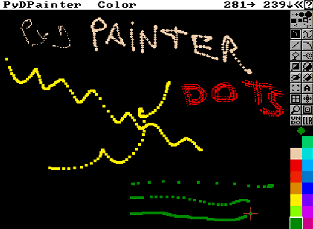
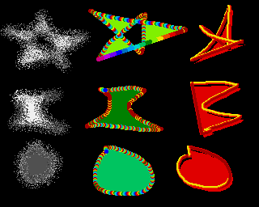
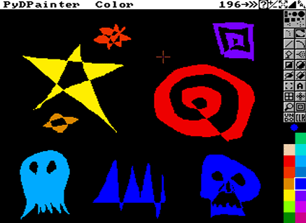
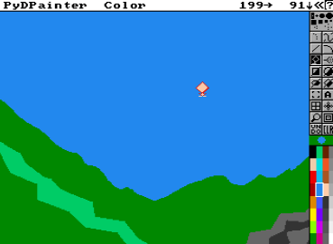
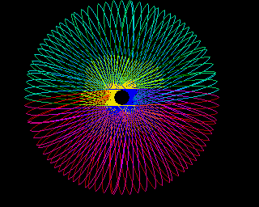
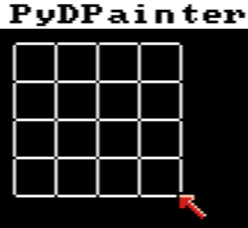
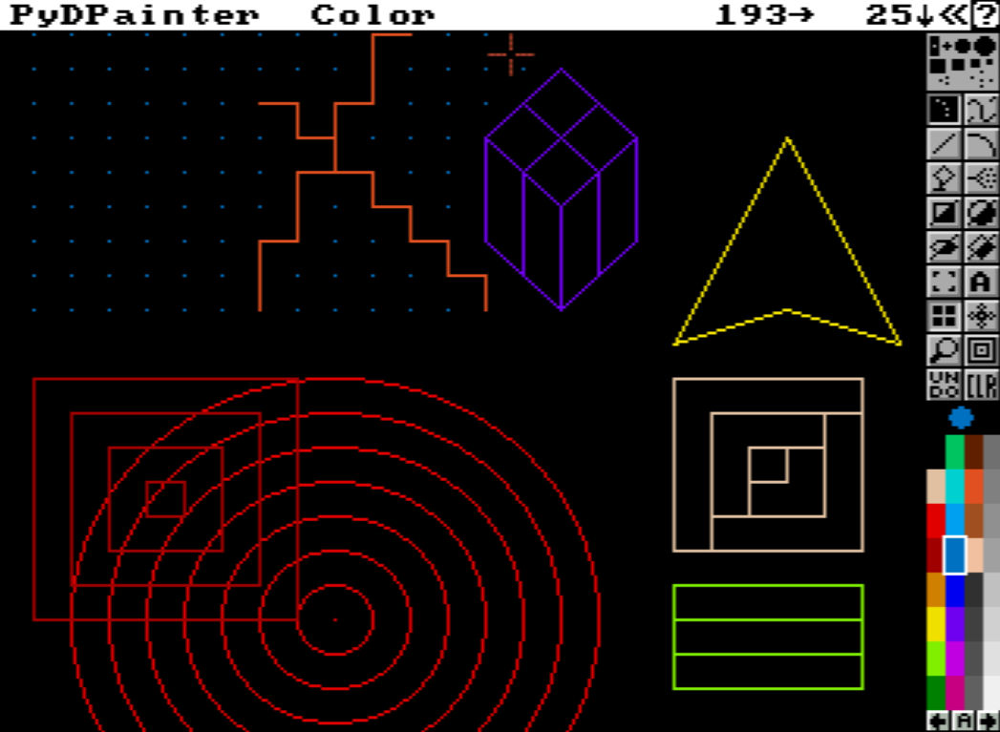
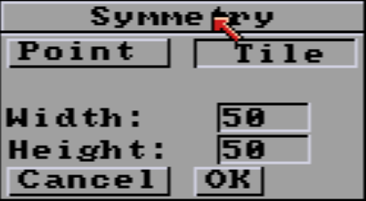

# Toolbox

Welcome to the heart of **PyDPainter** and, before it, **Deluxe Paint**. Long
before toolbars became an obvious standard in graphics software, DPaint
provided an efficient interface.

  

A mouse **left-click** on a tool selects it directly. A **right-click** brings
up the tool's options.  Finally, the tool itself can be halved diagonally,
providing a variant - usually the same shape, but filled in.

These options are backed up by very short keyboard shortcuts (a single letter),
the capital letter of which brings up the variant or the options.

- [Toolbox](#toolbox)
  - [Default brushes](#default-brushes)
  - [Dot tool](#dot-tool)
  - [Draw/Area tool](#drawarea-tool)
    - [Filled Area (freehand filled shapes)](#filled-area-freehand-filled-shapes)
  - [Line tool](#line-tool)
  - [Curve tool](#curve-tool)
  - [Fill tool](#fill-tool)
  - [Airbrush tool](#airbrush-tool)
  - [Rectangle tool](#rectangle-tool)
  - [Circle tool](#circle-tool)
  - [Ellipse tool](#ellipse-tool)
  - [Polygon tool](#polygon-tool)
  - [Brush tool](#brush-tool)
    - [Transparency of brushes](#transparency-of-brushes)
  - [Text tool](#text-tool)
  - [Grid](#grid)
    - [Size X,Y](#size-xy)
    - [Offset X,Y](#offset-xy)
    - [Visual](#visual)
    - [From Brush](#from-brush)
    - [Examples](#examples)
  - [Symmetry](#symmetry)
    - [Point Symmetry](#point-symmetry)
      - [Order](#order)
      - [X Y values](#x-y-values)
      - [Center](#center)
      - [Place](#place)
    - [Tile Symmetry](#tile-symmetry)
  - [Magnifier](#magnifier)
  - [Zoom magnifier in/out](#zoom-magnifier-inout)
  - [Undo/redo](#undoredo)
  - [Clear canvas](#clear-canvas)
          - [Documentation written by Stephane Anquetil](#documentation-written-by-stephane-anquetil)

## Default brushes

Here you can choose a pre-defined brush from ten built-in brushes: four round
ones, four square ones, and two made up of a number of separate pixels.

*Note that their size can be changed quickly, even while drawing, and without
enlarging the pixels.*

For example, with the usual brush shortcuts:

- `+` and `-` keys to enlarge and reduce
- `H` to double the size
- `h` to halve the size

Upon startup, **PyDPainter** will default to a single pixel (a dot) as the
drawing brush. You can quickly return to this by using the `.` shortcut on the
keyboard.

## Dot tool

The Dotted Freehand Tool allows fast freehand drawing. Note, however, **that
the faster you go, the bigger the gaps in your drawing**. It can be handy to
use and see the shape of a customized brush. Try drawing with it using some of
the other brushes to get a feeling for how it works.

|  |
| :----: |
| *Speed and brush shape alters the line appearance.* |

Holding down the `SHIFT` key while painting constrains the tool to move either
horizontally or vertically, depending on the direction you move the cursor
immediately after pressing `SHIFT`.

Key: `s`

## Draw/Area tool

The Continuous Draw tool produces unbroken lines. Don't forget that you can use
any brush or your own brushes.

Press the `SHIFT` key for a horizontal or vertical line constraint.

_Note: In the past, real Amiga software would have slowed down with mouse
movements that were too fast and brushes that were too large, but with
PyDPainter running on modern computers this is no longer the case._

Key: `d`

### Filled Area (freehand filled shapes) ###

Allows you to draw a freehand area with the mouse, which will then be filled in
with the current fill mode. When you release the mouse button, the shape you
paint is filled with either the foreground or background color, depending on
which mouse button you press when you paint the shape. If you release the mouse
button before you close the shape, **PyDPainter** closes the shape for you with
a straight line from your cursor position to where you began the shape.

Current brush is ignored unless you press `ALT` while clicking on the tool.
Then both tools, drawing and fill, are drawn with the same shape you make on screen, including the possible stroke options (defaults or custom brush, current Mode, spacing options like airbrush, etc.).

Holding down the `Alt` key as you click on the Filled Freehand Shape tool causes the tool to paint shapes that are filled and then outlined with the current brush using the settings of the [Brush Trails](brushtrails.md) requester. If you use a custom brush as your current brush, it is possible to paint shapes that are filled with one color and outlined with another. The outline is painted by tracing the shape with the current brush. Note that the shape is traced by the brush handle; if the handle is offset from the brush, the outline will be offset from your filled shape.

Key: `D`

_Tip: Drawing a shape that intersects itself creates an interesting effect of unfilled holes. You can fill with background color, drawing with the right button._  

  

## Line tool

Draws straight lines by clicking and dragging the mouse.
First click and hold the button for the origin of the line, then move the mouse
and release the button to draw the line.
Press the `SHIFT` key for a horizontal or vertical line constraint.

This tool can be used in conjunction with custom Brushes and Modes.
With the `CTRL` key held down, the tool leaves traces between the two clicks.

Key: `v`

Right-click tool to open [Brush Trails](brushtrails.md).

## Curve tool

Draws curved lines between two points:

- Anchor the first point of the curve by pressing and holding the mouse button.
- Drag it to the point where you want the curve to end and release the button.
- As you move the mouse away from the end points, you'll notice
that the line is still "active," behaving as though it were a flexible wire
attached to the cross-hair. Accordingly, the line will curve to follow the
cross-hair wherever you drag it.
- As soon as the curve is the right shape, click the mouse button to
freeze it at that position.

With the `CTRL` key held down, the tool leaves traces while the curve is being
drawn. Use `Shift` or the [Grid](#grid) for aligned anchor points.

Key: `q`

Right-click tool to open [Brush Trails](brushtrails.md).

## Fill tool

Click the icon with the left button, move the cursor (which now looks like a
paint can) to an enclosed shape.  You can fill the shape with the current fill
mode by clicking the left button, and with the current background color by
clicking the right button.

*Note that the Fill tool fills all the way to the boundaries of an enclosed
shape. If the shape is not completely enclosed (that is, if there is a hole in
its perimeter), the paint will "leak" through and fill the entire page.*

Holding down the `Alt` key when you click with the Fill cursor, fills outward to the background color. In other words, the fill spreads
outward until it reaches areas of the current background color.

Standard filling is struggling. It stops at the edge of each color of the sky gradient.

Filling the sky with `ALT` stops only at the **background** color (green of landscape). Combined with the Stencils function, this is a very effective cleaning tool.

Key: `f`

Right-click tool to open [Fill](fill.md) type.

## Airbrush tool

By using the Airbrush in combination with the different
brushes, you can create a variety of effects, ranging from a fine one-pixel
spray to a coarse spray made with the big brushes.

Click the Airbrush icon with the left button, and then try painting
with it using the various brushes. Try it with the three- and five-pixel brushes, and then try it with the big
brushes.

*Note that, just like a regular airbrush, if you keep the mouse
button pressed without moving the mouse, the paint continues to build
up in one spot.*

Key: *no hotkey*

Right-click tool to resize nozzle size.

Press the `SHIFT` key for a horizontal or vertical line constraint.

Press the `CTRL` key to slow down the Airbrush flow rate.

## Rectangle tool

The Rectangle Tool lets you draw squares or rectangles, either unfilled
or filled with the current brush or background color.
- Click to define a corner origin, and hold down the mouse button.
- Move the mouse freely, including to the other side, and release the button when you like the shape.

In any case, the rectangle is completed as soon as you release the button.

*Remember, top left for unfilled, and bottom right for filled shapes.*

Key: `r`

Right-click tool to open [Brush Trails](brushtrails.md) or [Fill](fill.md) type.

Press the `SHIFT` key for a square drawing constraint.

Press the `CTRL` key to draw rectangles on the fly as you move the mouse.

## Circle tool

Press and drag with the left button to create a circle with the current
draw mode, or with the right mouse button to create a circle bordered or
filled with the current background color. Hold down the button and release when
you're happy with the shape.

*Note: circles are painted from the center outward, so it's easy to put a
circle around anything just by starting to paint from where you want the center
of the circle.*

Key: `c`

Right-click tool to open [Brush Trails](brushtrails.md) or [Fill](fill.md) type.

Press the `SHIFT` key to start with the next circle center on your last click.

Press the `CTRL` key to draw circles on the fly as you move the mouse.

## Ellipse tool

The Ellipse Tool works just like the [Circle tool](#circle-tool), except that it is still "active" after you release the mouse button. Here's how it works:

1. Click the icon with the left mouse button (remember, top left for unfilled, and bottom right for filled shapes)
2. Move the pointer to the painting area, and draw an ellipse by dragging the mouse. Now release the button. Note that even though you have released the button, the ellipse continues to change shape as you move the mouse around.
3. As soon as your ellipse is just the right shape and size, press down
the mouse button and hold. Now you can rotate your ellipse until it has just the right tilt.
4. When it is in just the right position, release the mouse button.

Key: `e`

Right-click tool to open [Brush Trails](brushtrails.md) or [Fill](fill.md) type.

With the `CTRL` key held down, the tool leaves traces while the curve is being drawn. Use `Shift` or the [Grid](#grid) for aligned anchor points.
Amazing results can be achieved easily:  

## Polygon tool

The Polygon Tool lets you keep drawing straight lines until you have
created a closed figure. Here's how it works:

- Click the button once to anchor the starting point of your polygon and then a second time to complete the first line, as if you were using the Straight [Line tool](#line-tool).
*You will notice that your cross-hair is still connected to the first line by a second straight line.*
- Click the button again to finish that line, and so on until you have
completed your polygon.
The polygon is completed as soon as you click the button with the cross-
hair on your starting point indicated by a square white outline.

Quickly double-click to stop the shape immediately. In fill mode, the shape is automatically closed by a straight line that joins the first point.

*Note: Filled polygonal shapes with intersecting sides create interesting graphic effects.*

Key: `w`

Right-click tool to open [Brush Trails](brushtrails.md) or [Fill](fill.md) type.

## Brush tool

The brush is a special tool that is an essential part of **DeluxePaint's** legacy and versatility. With the Brush Selector, anything can be a brush:
 - any piece of artwork, any part of your painting area
 - any text you put on the screen
 - any shape you previously have drawn, even in multiple colors.

Step-by-step operation:

1. click on the brush tool
2. the mouse pointer is now extended by two white alignment lines, which are superimposed on any graphics in the drawing area
3. click on a corner of the selection area, **keep the button down**
4. drag the mouse to the opposite corner
5. release the button
6. this area is now your new brush, and you can draw with it!

Not just once, like a stamp, but with all the drawing tools: freehand draw, line, rectangle, circle and even ellipse! Experiment with different brush shapes and stroke tools to understand the power and simplicity of the brush tool.

There's a special [Brush](../../menus/src/brush.md) menu, with dedicated effects and functions.

*Try the [Matte](../../menus/src/mode.md#matte) (`F1` - the default), [Color](../../menus/src/mode.md#color) (`F2`), and [Repl](../../menus/src/mode.md#repl) (`F3`) modes.*

And the best part: there are also **[Fill Types](fill.md)** that use the brush as a pattern! More on that later.

For greater precision, you can click on the brush tool a second time (or press  `b` again) to switch to a polygonal brush tool. It works in the same way as the Polygon tool, but to delimit the area to be captured as a brush. Note that in Replace mode, the stamp remains rectangular.

### Transparency of brushes

However, there is one aspect of brush selection you should be aware of: if any parts of your brush consist of the current background color, those parts will be transparent. In other words, whenever you pick up a brush, it's as if you are picking up only the non-background colors; any background colors in the brush will remain invisible even after you change to a new background color. This means that you can create brushes with intricate outlines without fear of picking up a rectangle of the surrounding background color.

*Tip: What's more, if you delimit a brush on the screen, but this time by clicking with the right mouse button, this will erase what you've taken as a brush from the screen. This allows you to move blocks of graphics quickly.*

Press the `SHIFT` key during use for for a "square" constraint.

Key: `b`

## Text tool

The Text tool lets you place text anywhere on the page, and the Brush Selector lets you pick it up and reposition it if you didn't have it quite right the first time.

To enter text on the page:

1. Click the Text tool
2. Move the cursor to the page and click where you want to start typing text. (This leaves the text cursor on the page.)
3. Now type on the keyboard
4. Press Enter to move to next line
5. Click elsewhere to start again
6. Press **ESC** or select another tool to exit the Text tool

The text will "wrap" around to the next line when it reaches the end of
the line, or you can press Return to start a new line directly below the
point where you first placed the cursor. If the page size is larger than the
screen, the screen will scroll to the edge of the page as you type. You can
delete text by using the **`Backspace`** key.

Note, however, that if after entering a portion of text you click the cursor elsewhere on the screen, or you select a tool from the Toolbox, that text becomes a bit-mapped image, and no longer behaves as text. In other words, you cannot **`Backspace`** over it as you could when it was still active as text.
You can change the color of your text by choosing a different foreground
color.

---

If you right-click on the text tool, you'll access text options, including choosing a font.

**AA** is depressed by default, for **anti-aliasing**. For a more pixelated effect, remove it. Please note that "bitmap" fonts are no longer a common standard, so don't hesitate to install some fonts on your system from these sites:

* [Workbench Topaz](https://www.sblendorio.eu/Misc/TopazFont)
* [Bitmap on Dafont](https://www.dafont.com/bitmap.php)
* [Fontstruct](https://fontstruct.com/gallery/tag/707/Amiga?category=any)

Note the approximate height, and enter it in the **"Size"** field. 8 is a good default size for legacy bitmap fonts.

*ColorFont and AmigaFont are not yet supported.*  

Key: `t`

## Grid

  

The Grid constrains the action of **all painting tools**:

*V.2.1.0 added number spinners to increase/decreae value with a mouse click. Keep the mouse button down to change values faster.*

### Size X,Y

Pixel length and height of the grid. This means that, for example, a line or a drawing can only be drawn at the same pixel spacing. If you're creating tiles for a video game, this size will be the size of your tiles (e.g. 16x16 px). This allows you to create a reference grid. Desactivate the grid tool as you draw (same icon).

### Offset X,Y

Offset from origin (0,0) at top right of work screen.

### Visual

Show a visual grid on the screen which you can resize and position with the mouse to set the grid parameters.

### From Brush
This takes the current brush size and copies it to the grid size. It's very convenient to test the placement of your tiles (grabbed with [Brush](#brush-tool)) side by side effortlessly. Maybe use `Handle Corner` multiple times to handle the brush by the most convenient corner.

### Examples

The grid can help you quickly draw geometric shapes, spritesheets templates, regular shapes and dot grids. Experiment with different tools, in conjunction with the `SHIFT` and `CTRL` keys!

Key: `g`

## Symmetry

The Symmetry tool helps you paint symmetrical patterns around a
central point or based on a tiling scheme. Symmetry works with **all tools**
except Text and Brush Selector.

There are two symmetry modes : **[Point](#point-symmetry)** and **[Tile](#tile-symmetry)**. Click the symmetry tool with the right mouse button to set parameters for each of the mode.  

### Point Symmetry

**Point Symmetry** works around a central symmetry point in either **Mirror** (mirror image duplication of each point) or **Cyclic** (direct duplication at each symmetry point).

*Note: the default Mirror, Order 6 settings is not the most useful, which can lead to the false impression that symmetry is just a way of plastering the screen all willy-nilly.*

#### Order

You can lower the **Order value to 1** with **Mirror** on to retain a basic mirror function. The left and right parts of the screen will be copied as a mirror erected vertically in the center of the screen.  

An **Order of 2** imitates a paper folded into 4, like the Rorschach tests.

**Cyclic symmetries** of order 2 to 7, especially the odd values, once offset from the center of the screen, let you effortlessly draw bold natural shapes, such as flowers, an impact on the ground, the cracks in a window, a tunnel narrowing...

Values of 5 and above, used with the Line tool and a little practice, will help you draw regular polygons.

The maximum is 99, which may sound crazy, but allows for some very amusing variations on the circle design.

#### X Y values

The X and Y values allow you to manually enter the origin of symmetry. Note that an origin of 0 may render the tool invisible (it draws outside the screen).

#### Center

The two Center buttons automatically calculate the correct value to center the symmetry point, depending on the size of your page/work screen (that of PyDPainter).

#### Place

To reposition the central point of your symmetrical pattern:
1) click **Place**,
2) move the large cross-hair to the new location
3) and click the left mouse button.

### Tile Symmetry

  

Use Tile Symmetry to create 'tile' patterns. You can set the horizontal and vertical dimensions (in pixels) of the tile size. Tile is useful in creating fill patterns; once you've created your symmetrical pattern, set the [Grid](#grid) to the same spacing as the tiles to pick up exactly one tile as a
brush.

*Tip: use Tiles in the spare screen (**`j`**) instead, as it fills up the screen very quickly.*

|  |
| :----: |
| *Yeah, easy 90s pop Memphis style wallpaper, baby!* |

Key: `/`

## Magnifier

This tool divides the screen into two parts and displays the right-hand side in magnification. This tool is especially useful for detail work. When you are in Magnify mode, you can use any other tool on either side of the screen.

To move the magnified area around the canvas, use the arrow keys or the `n` key
to center the magnified area over the mouse pointer. You can also use the
middle mouse button to drag the magnified area around.

Key: `m`

## Zoom magnifier in/out

Changes the scale in [Magnifier](#magnifier) Mode. Click the Zoom tool with the left mouse button to enlarge the image and click with the right button to shrink the image. Or use the scroll wheel on a modern mouse.

Keys: `>` / `<`

## Undo/redo

Reverses the last painting action. Thanks to the huge memory capacity of modern computers, PyDPainter allows **up to 20 undos!**

Right-clicking "undoes" previous undos.

Keys: `u` / `U`

## Clear canvas

Clears the screen to the currently selected **background color**. If you have
multiple frames, an Options requester appears for you to indicate which
frames you want to clear.

Key: `K`

###### Documentation written by Stephane Anquetil
