# Anim Painting

Let's take a look at the new **AnimPainting** functions for drawing on an animation.

The principle is to use the familiar drawing tools:

- Dot
- Draw
- Line
- Curve
- Rectangle
- Circle
- Ellipse
- Polygonal

with brushs (custom ou default).
But instead of drawing on a single image (a frame in animation, that is), you draw on several frames in succession. Either over the entire animation, or over a number of frames defined by the “Spacing” options.

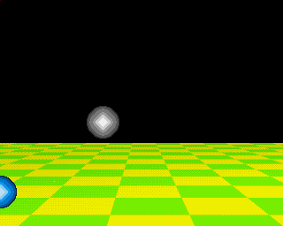

This tutorial uses files provided in the `iff_pics/` folder of the PydPainter software distribution.

## Load a background

First, Go to **Picture Menu**, **Open** and Load Picture into `iff_pics` folder, select `checkerboard.iff` then click **open**. It's a nice 3D-like background like this :

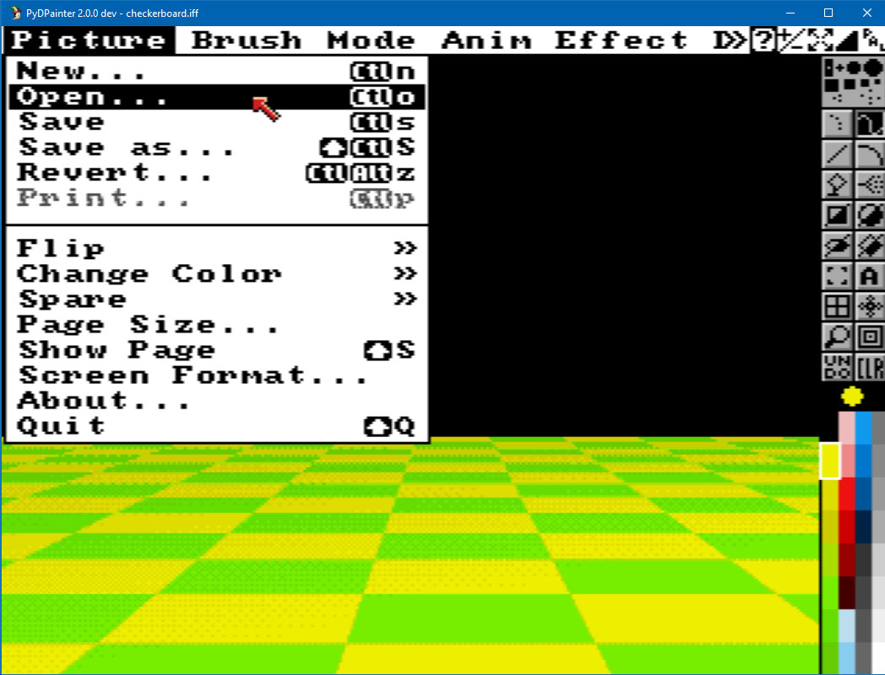

This image is 320x256 pixels (PAL low-res) with a 32-color palette redefined with pretty red and blue gradients that the following brushes will use.

*You could have loaded it with a simple drag & drop, but for the rest of the tutorial, you really need to go through the menus and the file request.*

## Load a ball as a brush

Go **Brush menu**, **Open** and select `blueball.iff`. It load a brush of a blue ball, what a sense of naming, really!

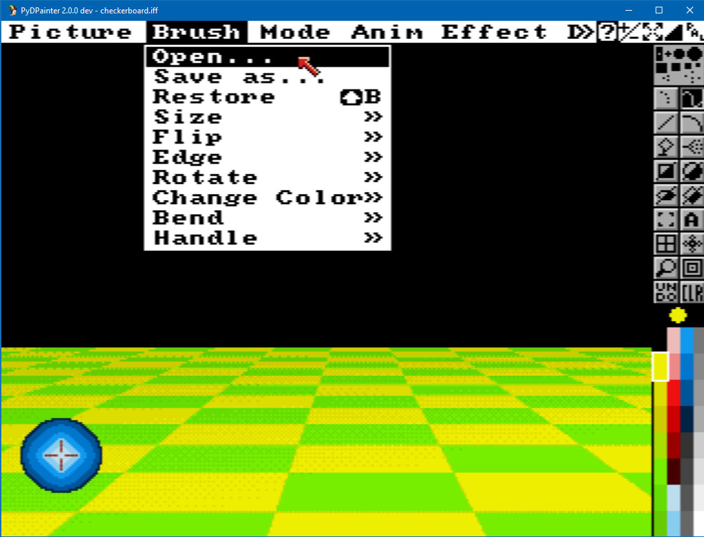

## Let's animate !

There are only three ways to switch PydPainter to “animation”:
- load an existing animation file (GIF or Amiga ANIM)
- import a numbered image sequence as frames
- define a frame number

Let's do the latter! Go to **Anim** Menu, **Frames, Set #** and enter 100. 

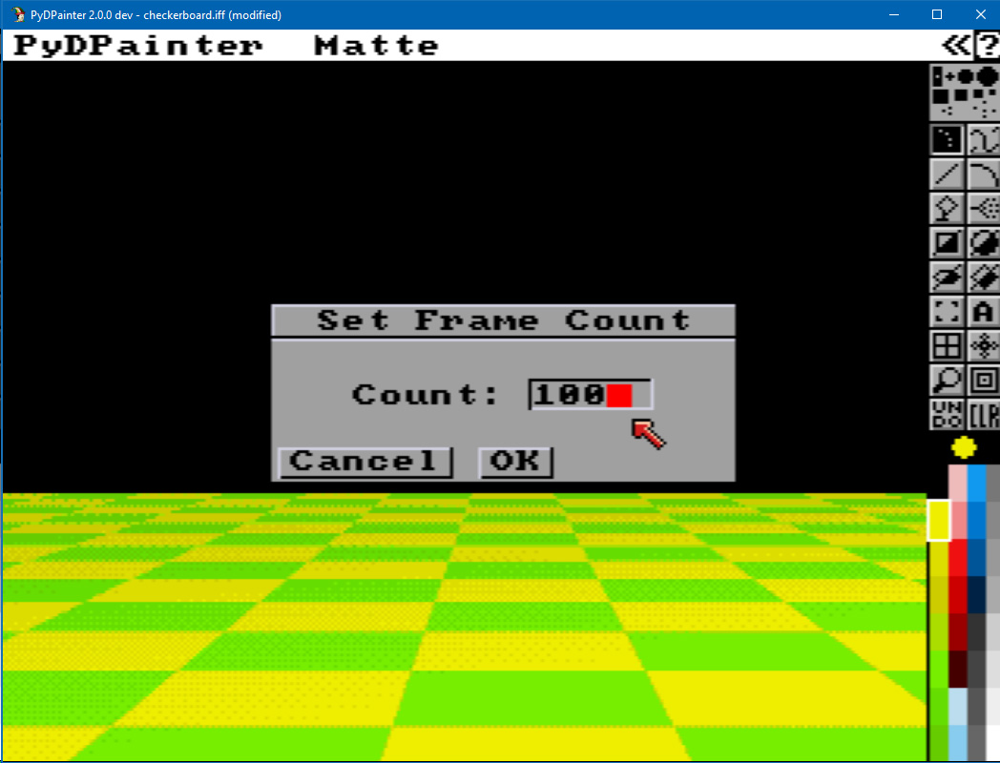
Note that in doing so, the current frame has been automatically copied everywhere. The 100 frames of the animation now have this magnificent checkerboard pattern.

An elegant new bar appears at the bottom. It includes obvious “VCR”-type functions for navigating through animation frames, and two still-mysterious icons in the shape of a palette and a clock.
This summarizes the functions of the animation toolbar.
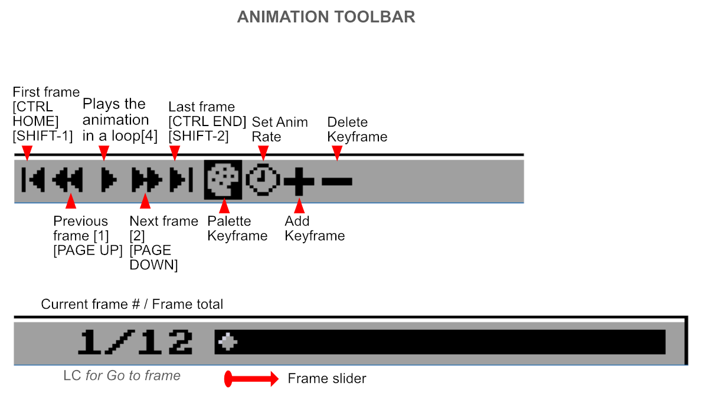

Quick help is available in a yellow bubble by hovering the mouse over the icons.  Note that you can toggle the display of this and other toolbars by pressing **F10**... repeatedly.

## First strokes !

Okay, let's dabble a bit with it, so you understand why we're going to freeze the background next.

First select the **Dots** tool, first line on the left.  

Scribble with the blue brush, hit **Next Frame** >> button (**2** or **PageDown** keys) then repeat 5 times. You now have 5 frames with random blue ball on it. Use the frame slider to check.
If you click **UNDO** tool, it deletes the last one if you never change the frame since.

*Although PydPainter has a level of 25 undo, it cannot handle this on different frames. So if you want to redo your trajectory in the difficult art of animation (and ball bouncing), you're in trouble.*

Clicking **Clear** (CLR) clears the entire screen. It goes back to the black blank screen.

  

Note 2 new choices: delete the **Current Frame** (the one displayed), **All Frames** in the animation or just an extract. But you lose the background, which is annoying. So we're going to freeze this pretty yellow and green checkerboard background.

## Fix background

Redo all steps from the beginning, *sorry:-(*.

Go to **Effects** Menu. **Background / Fix**. It's done.

Now, deleting (either with the drawing tools and the right mouse button) or the Clear tool, will keep everything that was on the screen at the time of the **Background Fix**. Yes, this means you can freeze the elements you draw as and when you're happy with them. 

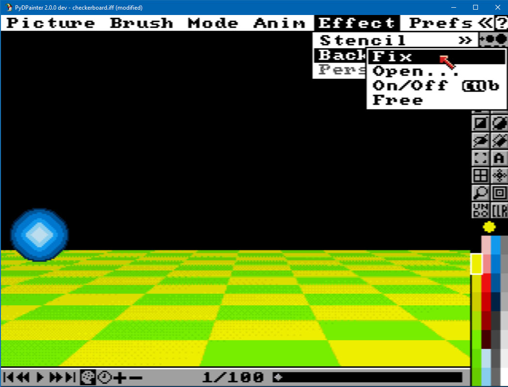

## Better than painting? Animpainting !

To activate, hold down the `Left-Windows` key or the `Left-Command` key on the Mac before you drag out a line or draw with a tool. When you let go of the mouse button, the brush will be stamped on successive frames.

*Tips: Press **Shift-B** or* `Brush/Restore` *menu to recall the last ball... er brush.*

Let's try !
1. Hit the Dot drawing tool.
2. Check you're at frame 1/100.
3. Hold down the Animpainting key of your system.
4. Move the ball around the screen, holding down the left mouse button as if it were the trajectory you wanted it to follow.
5. Then Release everything.
6. Exit the PC Windows menu if it was triggered. Click into the PydPainter windows.
7. Rewind and admire your animation skills!
8. Delete and start again. 

Move the ball around the screen, clicking frantically with the left mouse button as if it were the trajectory you wanted it to follow.

You can also try drawing by holding down the left mouse button all the way, but this will make clones of the ball.

Have a little fun, then let's move on to the next step, which brings a little more control for more realistic trajectories.

## Linear and curved trajectories.

Remember, Animpainting works for all dot and line-based tools (except airbrush). It also automatically adjusts to the number of frames if you have the **spacing option** set to **continuous**.

Select the Line tool.

Now the ball will follow the straight line you're about to draw.

1. Start from frame 1.  
*it's not compulsory, if you start from frame 25, the animpainting will loop and continue after 100 from 1 to 24.*
2. Press the Animpainting key (remember `Left-Windows` key or the `Left-Command` key on the Mac).
3. Draw a line from the far left to the right of the screen.
4. Release the key.
5. Play and enjoy !

### Faster ?

The result is slow. Why? We're at 20 fps (frame per second). Click on the clock icon to check.
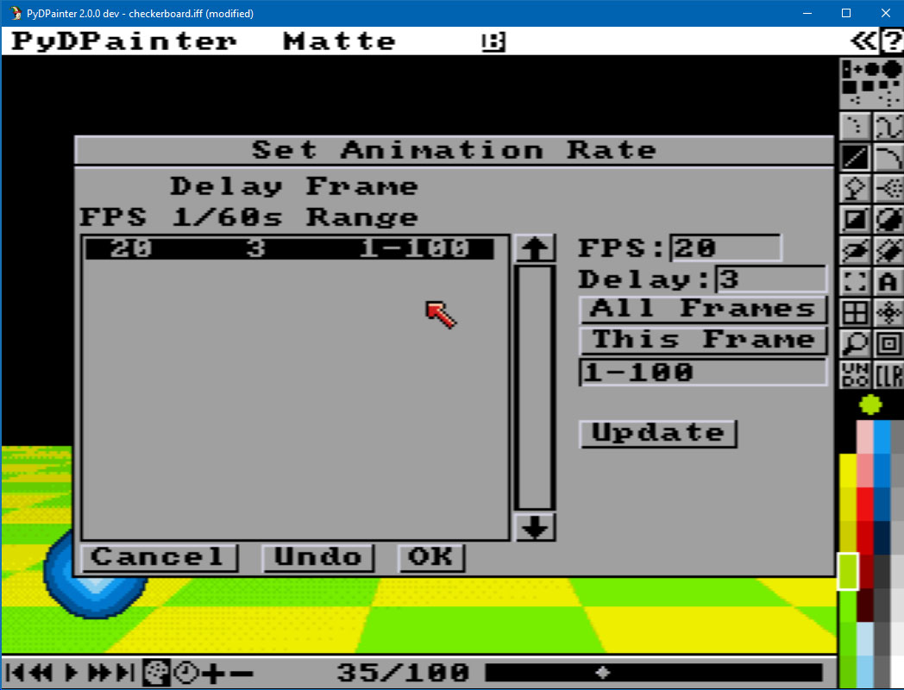
This means that with a path of 100 frames, our ball takes 5 seconds to pass through the screen (100/20=5).

Go to the **Spacing** options of the Line tool (right-click on the upper-left part of its icon). 
Change to **N total** 20.
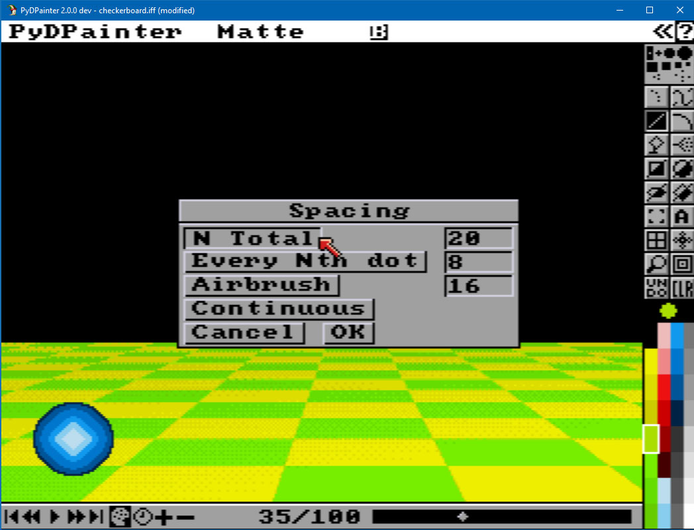

This means that our trajectory will be drawn with 20 “points” / balls and therefore 20 frames. In short, a lightning passage of one second. 

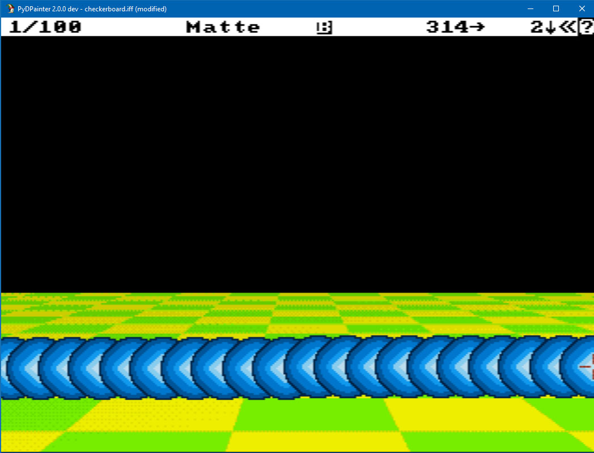
1. Start from 1.
2. Hit **F10** thrice to hide the right toolbar.
2. Press the Animpainting key (remember `Left-Windows` key or the `Left-Command` key on the Mac).
3. Draw a line from the far left to the right of the screen. 
4. Release the Animpainting key.
5. Hit **F10** to have the animbar again on screen.
5. Play the animation !

### Let's bounce !

We're now going to draw a bouncing red ball.

Load `redball.iff` in the **Brush / Open**... menu.

This time we want a 3-part trajectory:
- the ball arrives from the left of the screen and falls like a balloon
- it bounces a first time and falls again
- it bounces a second time, at a lower height, and leaves the screen at right.

We want to “simulate” a ball, i.e. a curved trajectory. Click on the Curve tool.

We'll therefore divide the animation into 3 parts of 33 frames each (100/3). In the **Spacing** options, set the **N total** to 33.

Starting at frame 1. In 3 curved traces, try to make this trajectory according to this model (I've made it as a drawing so you can see my curves).

You'll probably need a few tries. 

Now that you've understood the principle, you're thinking that the ball should leave the screen a little faster, so the last part of the game should be made up of fewer frames (thus reducing the total N value). You're right, you've got it.

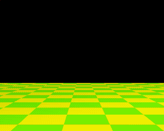

### Some pro tips

Go back one frame to position the ball perfectly at the end of the previous trajectory, then use the keyboard shortcut `2` or `Pagedown` to go forward one frame and continue the movement from that location wihout moving your mouse.

If the edge of the screen prevents you from making the "brush ball" disappear completely, change its handle from Center to any Corner with `ALT-X`` or go to **Brush / Handle / Corner**.
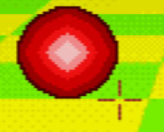

You can repeat this to change to any corner you want.

Animpainting automatically adjusts to the total number of frames if you have the spacing option set to continuous.

## Export your animation

To share your work, you can export to the following formats:

Animation file (Go to **Anim / Save...**). Fille a filename and choose one of the formats supported by PydPainter in the small drop-down menu on the right.
- **ANIM5** is amiga legacy, but you can't play it easily wihout an Amiga or emulator.
- **Animated GIF** is a very common format, your browser can read it for example.
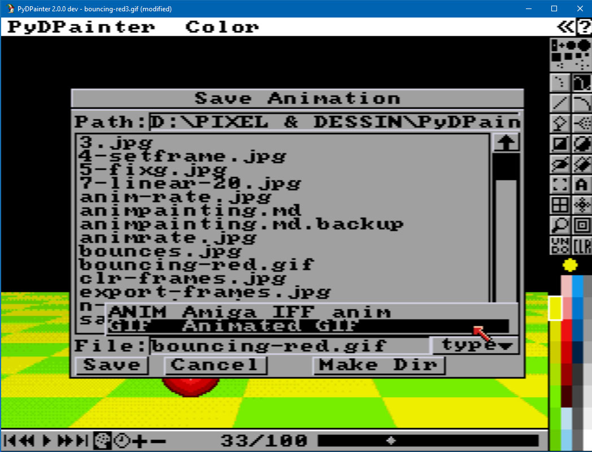

You can also export all frames at once as a succession of numbered images, and this automatically.
Go to **Anim / Frames / Export...** Then type a file name and choose one of the image formats supported by PydPainter in the small drop-down menu on the right.

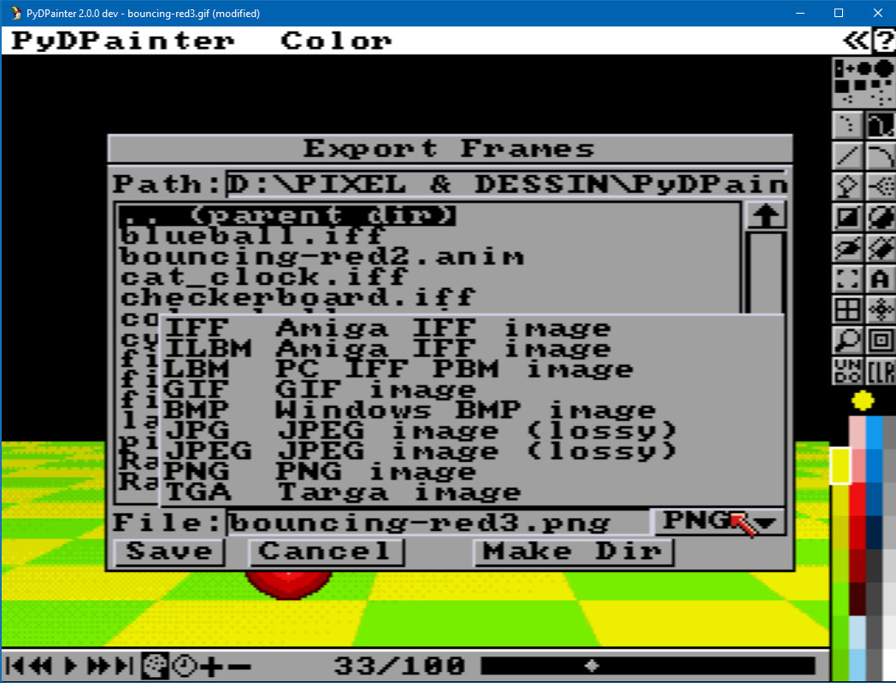

***Note that saving an animation does not preserve the sources of the entire project, remember to save the brushes used (as Brush) or the background and spare screen (as Picture).***

## Others drawing tools

Now that you've got the hang of it, you can get to grips with the remaining drawing tools:

 **Circle** Tool will make you brushs that draw circles.

 **Ellipse** will give you the impression of space orbits.

 **Polygon** drawing tool will allow you to make balls that bounce violently everywhere, a bit like a game of billiards.

Experiment and have fun !

###### Tutorial written by Stephane Anquetil
