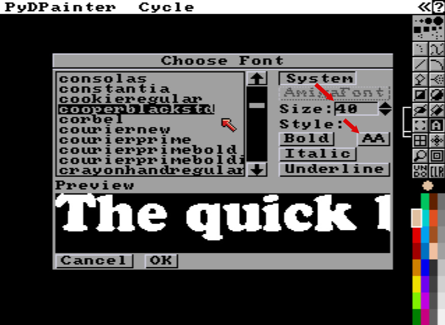
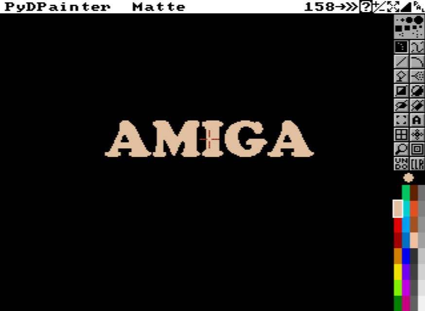
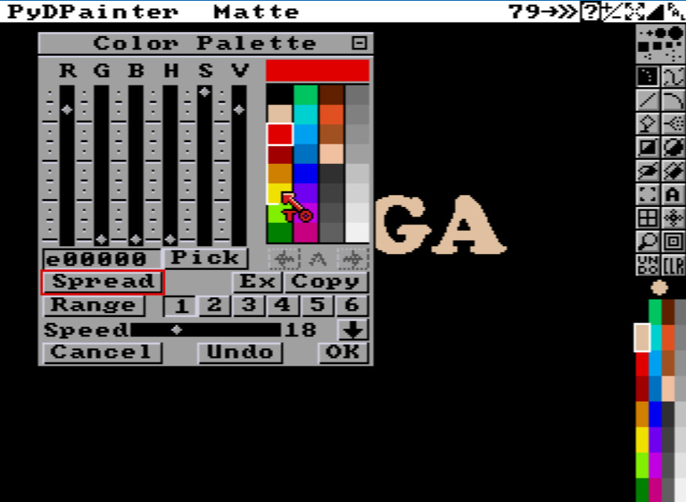
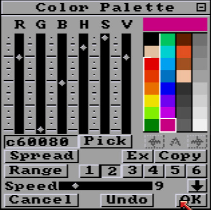
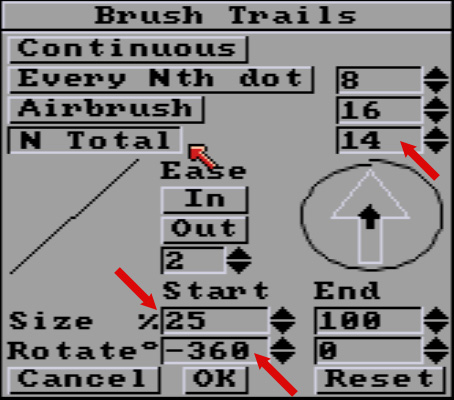
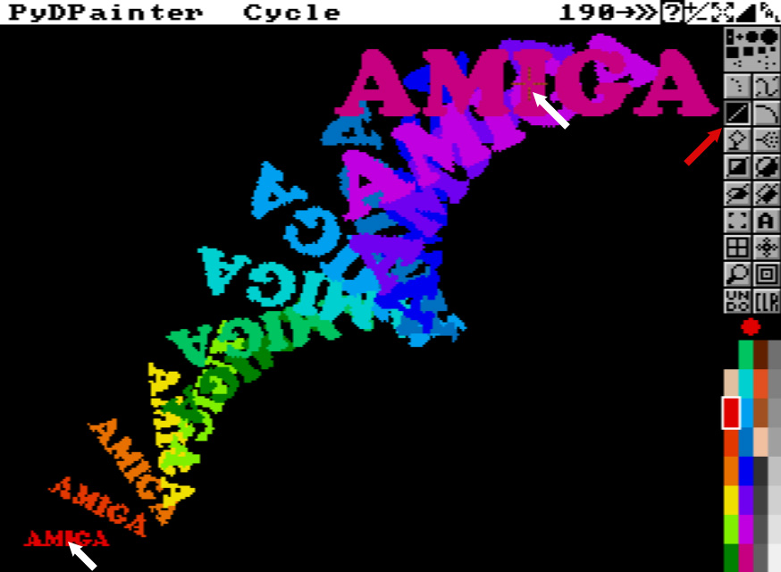
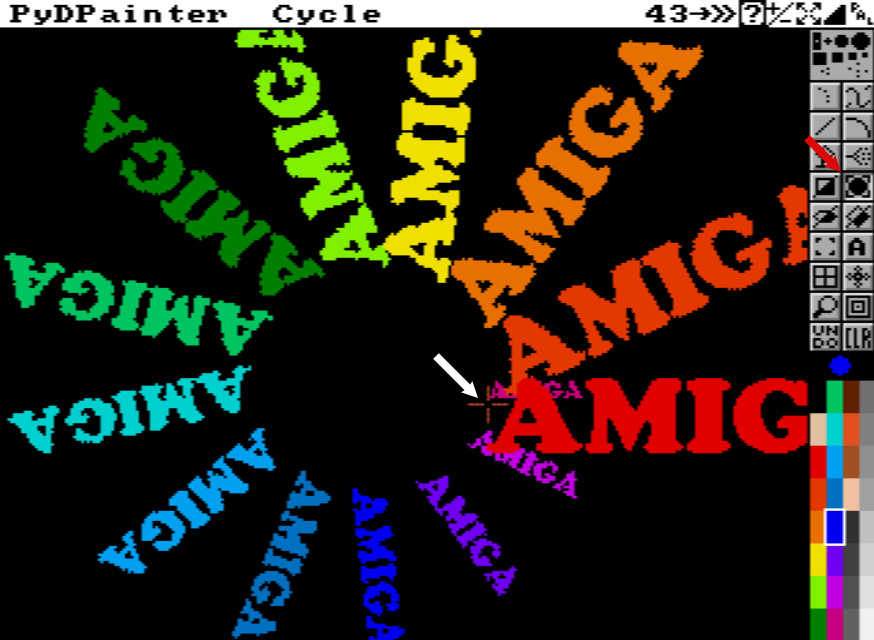

# Introduction to Move parameters Tutorial

These new settings are hidden in the formerly **Spacing** options.
They have two uses:
- to manipulate the sizes and rotations of any brush (custom or in-built), as you draw.
- add a way to create fluid animations (text effects, bounces, trajectories) using Animpainting.

If you're familiar with Deluxe Paint III's "Move Requester", it's close. Rather than reproduce it, PyDPainter has opted for a different approach.

*This tutorial is designed to get you up and running quickly. However, keeping with **PyDPainter**'s and **DPaint**'s original philosophy, remember that parameters and options can be combined quickly (sometimes with the touch of a key), and that the potential of this lies in experimentation, not in ticking off premade options.*

## Beginners

If you're a complete beginner, first familiarize yourself with the [toolbox](../../../tools/src/toolbox.md) icons. Help bubbles can be activated using the expandable mini icons bar (top right of the screen).

## First, let's create a text as custom brush.

1. Open Text parameters (right-click the **Text tool** icon). Pick a bold font of your choice. I choose an Amiga-nostalgia CooperBlack, I found [on the internet](https://fontsgeek.com/fonts/Cooper-Black-Regular). Let's make sure **AntiAliasing** is off (AA button released). Increase **Size** up to 40 or more, depending of your OS and the font you choose. See example below. Click OK when done. 

2. Type any title. I keep with the Amiga theme, using "AMIGA" in upper letters.
3. Grab it using the Brush Tool  with a left-click selection rectangle. Try to catch all the text without cutting it off, as close as possible to the pixels, to obtain a brush size as close as possible to the text.

At this point you should have the Amiga text following your cursor, and you can draw with it. Multiple **Undo** and repeat the steps if it doesn't work.
Use **CLR** to clear the screen when done.

## Changing color each step you draw

1. Use the menus to select **Mode/Cycle** (or press `F7`). Select the yellow, 5th in the color Selector. If you paint left-clicking this, it will produce your text with orange, yellow or green colors. If not, make sure in **Prefs**, the **MultiCycle** option is unchecked. Hit `F7` again.

## Expand to a better colorfull Cycle

1. Open **Palette** with `p` key.

2. Click on the first red color. Then click the **Spread** button. Your mouse cursor is now "To". Click on the yellow to generate a nice orange gradient beetween theses two colors. See bellow.

We need to expand the **Range** to use all thoses colors in a nice rainbow.

3. Click on **2** button to select the second range. *(we were in the first one by default)*
4. Click on the first Red color again.
5. Click the **Range** button. "To" cursor again.
6. Click the last pink at the end of the second column.
   

We got this lovely rainbow with a Range 2 that includes it (the white bracket next to the colors) as shown in the following image.

That's it, click OK to close the palette.
It may have been a bit boring for the experienced, but it's going to be very cool. Let's get to work on those new Move settings!

## New Move parameters in Brush Trails !

1. Open any **Spacing** parameters using the right-click on any drawing tool : line, curve, rectangle, circle, ellipse. All those drawing tools plus **Draw** shares the same options.
It brings up the updated **Brush Trails** panel. Well, spacing was a rather limited term when you consider the scope of what we can do there now.

Its parameters can be used with any drawing tool. Even in continuous **Draw**. But it can get chaotic fast. Just so you understand, we're going to make simple straight lines, and lines using a defined number of brush strokes along its length.

2. So let's press the **N Total** button. Default is 20 steps.
First, let's try to match this setting to the exact number of colors in our new Color Cycle Range. If we check the rainbow in the color selector, we count 14 colors.

3. Enter 14 in the **N Total field**. Watch for the red arrows bellow to help you locate the settings.

Let's start with a double effect for our current brush:
- **Size**:  our Amiga text will start at a quarter of its size and grow to 100% of its current size (the brush as it is).
- **Rotate**: our text brush will rotate through 360°. I put it in negative because it's prettier that way, trust me.
4. Enter these parameters:
**Start size %** 25
**Start Rotation°** -360
5. Validate with **OK**.
6. Click on **Line Tool**.
Is our brush with Amiga text still there? Hit `B` to restore last Brush if not.
7. Make sure Red color is selected (or any color inside the **Range**) and you are in **Cycle Mode** (`F7`).
8. Draw some lines to understand the effect.
   
Each line has 14 steps of your brush, rotating completely around 360°, from a 25% size to it's full size and final orientation. Those
steps paint through the 14 colors range of rainbow colors we defined earlier, thanks to Cycle Mode, starting with the red and ending with the pink. The superimposing of colors helps you understand the order in which things are drawn, from the beginning of your line to the end. If you don't like the color order, you can reverse it in the **Palette** with the big up/down arrow above the **OK** button.

 
*Drawn with a line from left bottom to top right.*

Now you can **clear** the screen with the **CLR** icon and try out other drawing tools, such as the **Circle**.

See also how the brush handling point (the orange dotted crosshair you have in the middle of your brush) can affect the way things are rotated. Try the four different **Brush / Handle / Corner** (in the **Brush** menus or hit `alt x`) while drawing to understand the idea.

 
*A Circle with the same brush, but handled from the left, make the Text rotate around it's beginning letter A.*

Let's end with an easy animation.

1. Go to **Anim / Frames / Set #**...sub menu.
2. **Set Frame Count** to 14 *(It's easier to have the same numbers of steps as set in **N total** **Brush Trails** settings)* and hit OK. You're now in the first frame of your 14 frames Animation. Check the navbar below the screen to control animation.
3. Select the **Line Tool**.
*You can use Cycle mode or not as you like.*
4. Go tho the upper left of the screen.
5. Hold the **Animpainting** key down. It's `Left-Windows` on PC, `Left-Command` on Apple and Linux.
6. Click and hold once, move the mouse to the opposite right bottom corner, so we see the entire text at the end. Release your mouse button when happy with the preview.
7. Release the **Animpainting** key. *On some PC, the Windows start menu may pop up and annoy you. Cancel it (`ESC`) and go back to PyDPainter.*

8. Hit Play icon or `Space` key and enjoy the animation you create ! Hit `ESC` to end replay.
9. Save as Animated GIF to share it. Go to **Anim / Save...** menu, enter a filename and choose **Animated GIF**.
   

If you want to restart, **Clear All Frames**, Go to frame 1 and start again. **Undo** will not works across multiple frames.
Now you can stack several animation, try new Move parameters, start with another color of the cycle, try your own brushes...

In [this another tutorial](../animpainting/animpainting.md), we'll show you more how you animate using Animpainting.

###### Tutorial written by Stephane Anquetil
